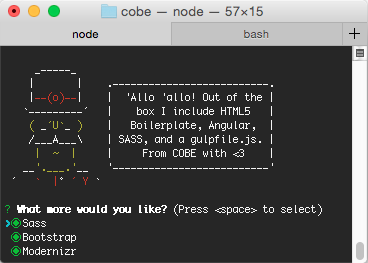

# Cobe angular generator

[Yeoman](http://yeoman.io) generator that scaffolds out a [Angular](https://angularjs.org/) application using [gulp](http://gulpjs.com/) for the build process. This generator is build on top of the [gulp-webapp](https://github.com/yeoman/generator-gulp-webapp) generator.

Build by people from [COBE](http://cobeisfresh.com/) with <3

## Features

Please see [gulpfile.js](app/templates/gulpfile.js) for up to date information on what we support.

* CSS Autoprefixing
* Pre commit hook that runs jshint and tests
* Built-in preview server with BrowserSync
* Automagically compile Sass with [libsass](http://libsass.org)
* Automagically lint your scripts
* Automagically minify your scripts
* Automagically generate angular templates
* Automagically wire-up dependencies installed with [Bower](http://bower.io)
* Awesome image optimization
* Easy unit testing with Karma and Jasmine

*For more information on what this generator can do for you, take a look at the [gulp plugins](app/templates/_package.json) used in our `package.json`.*

## libsass

Keep in mind that libsass is feature-wise not fully compatible with Ruby Sass. Check out [this](http://sass-compatibility.github.io) curated list of incompatibilities to find out which features are missing.

If your favorite feature is missing and you really need Ruby Sass, you can always switch to [gulp-ruby-sass](https://github.com/sindresorhus/gulp-ruby-sass) and update the `styles` task in `gulpfile.js` accordingly.

## Getting Started

- Install dependencies: `npm install --global yo bower`
- Install the generator: `npm install --global generator-cobe-angular`
- Run `yo cobe-angular` to scaffold your Angular app
- Run `gulp serve` to preview and watch for changes
- Run `gulp test` to run your unit tests
- Run `bower install --save <package>` to install frontend dependencies
- Run `gulp` to build your webapp for production
### You need to manually install `npm install precommit-hook` after git is initialized 

## License

[MIT license](http://opensource.org/licenses/MIT)
